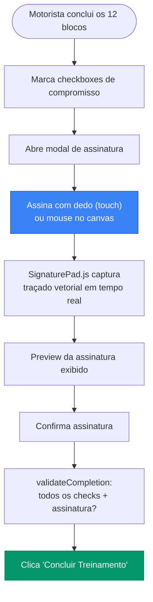
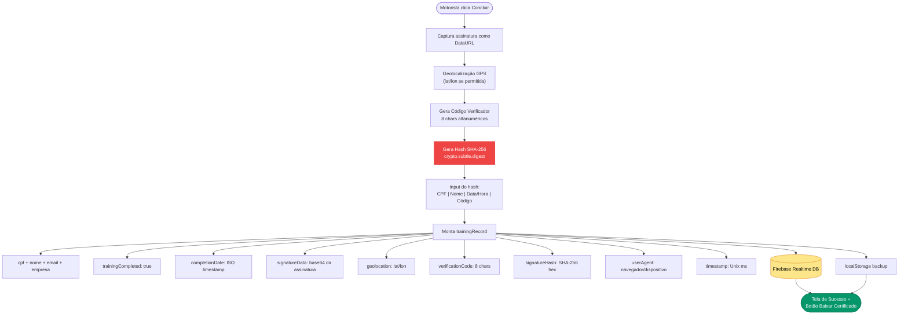
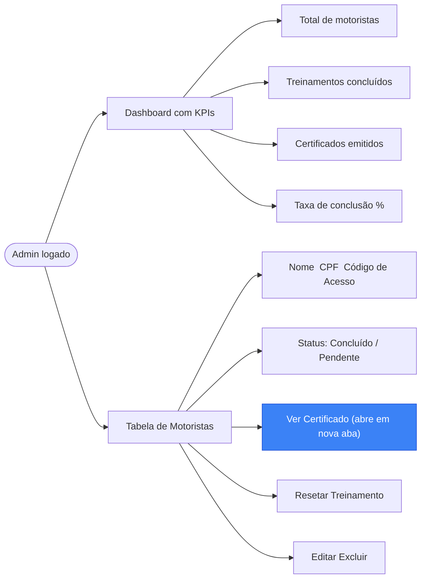
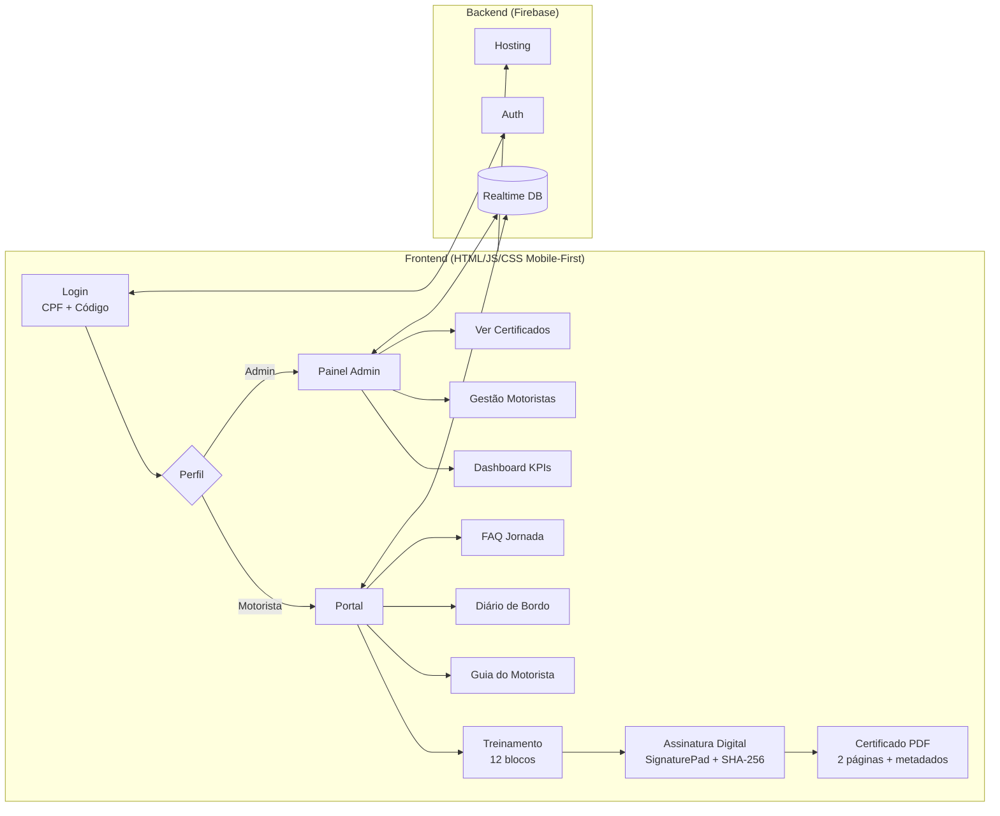
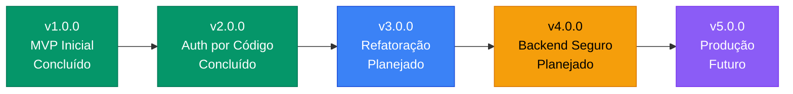

<h1 align="center">
   Gestão de Jornada  Motoristas
</h1>

<p align="center">
  <strong>MVP de sistema web para gestão de jornada, treinamento obrigatório e certificação digital de motoristas  em conformidade com a Lei 13.103/2015 (Lei do Motorista Profissional)</strong>
</p>

<p align="center">
  
  
</p>

<p align="center">
  
  
  
  
  
</p>

<p align="center">
  
  
  
  
</p>

---

##  Sobre o Projeto

**MVP funcional** desenvolvido para uma transportadora real, atendendo **+200 motoristas** em operação rodoviária. A plataforma digitaliza o fluxo completo de **treinamento obrigatório previsto na Lei 13.103/2015**, controle de jornada e emissão de **certificados digitais com validade jurídica**  substituindo processos manuais em papel.

>  **Este é um MVP (Minimum Viable Product).** O foco desta versão foi **validar o modelo de negócio** e entregar valor ao usuário final o mais rápido possível. O roadmap de evolução técnica está documentado abaixo.

---

##  Contexto Legal  Lei do Motorista (13.103/2015)

A **Lei 13.103/2015** estabelece obrigações legais para transportadoras e motoristas profissionais:

| Obrigação Legal | Como o Sistema Resolve |
|-----------------|----------------------|
| Controle de jornada com registro de início/fim |  Treinamento com módulo dedicado "Macros do Rastreador" |
| Intervalo de refeição mínimo de 1 hora |  Módulo "Descanso na Jornada" com regras visuais |
| Descanso interjornada de 11 horas |  Módulo "Interjornada" com exemplos práticos |
| Limite de 8h normais + 4h extras (12h total) |  Módulo "Horas Extras" com infográfico |
| Descanso semanal remunerado (DSR) |  Módulo "DSR Semanal" com cálculos |
| Treinamento obrigatório documentado |  **Certificado digital com assinatura e hash SHA-256** |
| Comprovação de que o motorista foi treinado |  **Termo de compromisso assinado digitalmente** |

### Por que isso importa?

Em caso de **fiscalização do Ministério do Trabalho** ou **ação trabalhista**, a transportadora precisa comprovar que o motorista:
1. **Recebeu treinamento** sobre suas obrigações legais
2. **Assinou termo de compromisso** de que entendeu as regras
3. **Possui certificado rastreável** com data, hora e evidências de autenticidade

**Este sistema gera toda essa documentação de forma automática, digital e rastreável.**

---

##  Jornada do Treinamento

O motorista percorre **12 blocos temáticos** progressivos, do conceitual ao prático:


Ao final, o motorista:
-  Marca checkboxes de compromisso com cada regra
-  **Assina digitalmente pelo celular** (tela touch) ou mouse
-  Recebe certificado imediato para download
-  Pode **revisitar o treinamento** a qualquer momento

---

##  Sistema de Assinatura Digital e Certificação

Este é o **diferencial técnico e jurídico** do projeto. O processo de certificação foi desenhado para ter **validade como evidência documental**:

### Coleta da Assinatura



### Geração de Evidências (handleTrainingCompletion)



### Camadas de Segurança da Assinatura

| Camada | Tecnologia | O que protege |
|--------|-----------|---------------|
|  **Assinatura biométrica** | SignaturePad.js (canvas touch/mouse) | Captura traçado único do motorista via celular |
|  **Hash SHA-256** | `crypto.subtle.digest` (Web Crypto API) | Integridade  qualquer alteração invalida o hash |
|  **Geolocalização** | `navigator.geolocation` | Prova de local onde a assinatura foi feita |
|  **Device fingerprint** | `navigator.userAgent` | Identifica dispositivo usado (celular, tablet, PC) |
|  **Código verificador** | 8 caracteres alfanuméricos únicos | Rastreabilidade  código impresso no certificado |
|  **Timestamp** | `Date.now()` + ISO 8601 | Prova temporal com precisão de milissegundos |
|  **Termo de compromisso** | Checkboxes obrigatórios antes da assinatura | Anuência explícita do motorista |

### O Certificado Gerado

O certificado digital possui **duas páginas**:

**Página 1  Certificado:**
- Nome completo do motorista
- Empresa vinculada
- Referência explícita: *"Controle de Jornada e **Lei do Motorista (13.103)**"*
- Data de emissão
- Carga horária (2h EAD)
- Badge " Assinado Digitalmente"

**Página 2  Termo de Compromisso + Metadados:**
- Declaração formal do motorista com CPF
- Compromissos assumidos (jornada, intervalos, credenciais)
- **Código Verificador** único
- **Data/Hora** exata da conclusão
- **Dispositivo** utilizado
- **Hash SHA-256** completo
- **Assinatura visual** capturada

>  O certificado pode ser **baixado como PDF** diretamente pelo motorista ou pelo admin.

---

##  Painel Administrativo

O gestor tem acesso em tempo real à situação de todos os motoristas:



### Fluxo do Admin para Baixar Certificado

```
Motorista conclui  Status muda para "Concluído" (tempo real)
                   Admin clica  "Ver Certificado"  
                   Certificado abre em nova aba com todos os metadados
                   Admin clica "Baixar PDF" (window.print otimizado para A4)
```

**Sem espera.** O certificado está disponível para download **no mesmo instante** em que o motorista finaliza o treinamento, graças aos listeners em tempo real do Firebase.

---

##  Mobile-First: Feito para o Celular do Motorista

Todo o sistema foi desenhado para funcionar **no smartphone do motorista**, em qualquer lugar  na base, no posto, na estrada:

| Funcionalidade | No celular |
|----------------|-----------|
| Login com CPF + Código |  Teclado numérico + campo de código |
| Treinamento completo (12 blocos) |  Slides responsivos, touch para avançar |
| **Assinatura digital** |  **Assina com o dedo na tela touch** |
| Download do certificado |  Salva como PDF no celular |
| FAQ sobre jornada |  Accordion otimizado para mobile |
| Guia do Motorista |  Conteúdo educacional visual |
| Diário de Bordo |  Modelo digital para preenchimento |
| Revisão do treinamento |  Acessa novamente a qualquer momento |

---

##  Funcionalidades Completas

| Módulo | Descrição | Destaque |
|--------|-----------|----------|
|  **Login Duplo** | Motorista (CPF + Código)  Admin (Google OAuth) | Código alfanumérico 6 chars, sessão TTL 24h |
|  **Treinamento** | 12 blocos progressivos sobre Lei 13.103 | Slides visuais, infográficos, tabelas de macros |
|  **Assinatura Digital** | Canvas touch/mouse + SignaturePad.js | Hash SHA-256, geolocalização, código verificador |
|  **Certificado** | 2 páginas: certificado + termo com metadados | PDF A4, badge "Assinado Digitalmente" |
|  **Dashboard Admin** | KPIs em tempo real por empresa | Firebase listeners com atualização automática |
|  **Gestão de Motoristas** | CRUD + código de acesso + regenerar | Modal com compartilhamento (email/WhatsApp) |
|  **Guia do Motorista** | Conteúdo educacional com infográficos | 9 blocos visuais sobre legislação |
|  **Diário de Bordo** | Modelo digital de controle mensal | Layout para impressão com orientações |
|  **Comunicados** | Avisos com contatos WhatsApp | Cards interativos com links diretos |
|  **FAQ** | Perguntas sobre jornada e Lei do Motorista | Accordion com respostas práticas |
|  **Tabela de Macros** | Referência rápida de macros do rastreador | Filtros dinâmicos por empresa |

---

##  Arquitetura do MVP



>  Documentação técnica completa de autenticação: [`docs/ARQUITETURA_AUTENTICACAO.md`](docs/ARQUITETURA_AUTENTICACAO.md)

---

##  Stack Técnica

```
Frontend        HTML5  CSS3  JavaScript (Vanilla ES6+)
UI Framework    Tailwind CSS (via CDN)
Backend         Firebase Realtime Database
Autenticação    Firebase Auth (Google OAuth + Código de Acesso)
Hospedagem      Firebase Hosting
Assinatura      SignaturePad.js (canvas vetorial touch/mouse)
Criptografia    Web Crypto API (SHA-256 via crypto.subtle.digest)
Certificados    CSS Print Styles (A4) + window.print()
Ícones          Phosphor Icons  Material Symbols
```

---

##  Estrutura do Projeto

```
 index.html              # Portal principal do motorista
 login.html              # Autenticação (CPF + Código de Acesso)
 admin.html              # Painel administrativo completo
 treinamento.html        # 12 blocos + quiz + assinatura digital
 certificado.html        # Certificado 2 páginas + metadados SHA-256
 comunicado2.html        # Central de comunicados
 diario_bordo.html       # Modelo de diário de bordo mensal
 faq.html                # FAQ sobre jornada e Lei do Motorista
 tabela.html             # Tabela de macros do rastreador
 firebase-config.js      # Config Firebase + funções auth/DB
 drivers.js              # Wrapper de dados de motoristas
 database.rules.json     # Regras de segurança Firebase
 .env.example            # Template de variáveis de ambiente
 docs/
    ARQUITETURA_AUTENTICACAO.md  # Doc técnico com Mermaid
 guia-motorista/
    index.html          # Guia educacional (9 blocos visuais)
    imagens/
 imagens/
```

---

##  Como Executar

### Pré-requisitos
- Conta no [Firebase](https://firebase.google.com/)
- Node.js 16+ (para Firebase CLI)
- Firebase CLI: `npm install -g firebase-tools`

### Setup

```bash
# 1. Clone o repositório
git clone https://github.com/lucianomjf14/gestao-jornada-motoristas.git
cd gestao-jornada-motoristas

# 2. Configure as variáveis de ambiente
cp .env.example .env
# Edite .env com suas credenciais Firebase

# 3. Atualize firebase-config.js com suas credenciais
# Substitua os placeholders YOUR_API_KEY, YOUR_AUTH_DOMAIN, etc.

# 4. Configure o Firebase
firebase login
firebase init

# 5. Deploy
firebase deploy
```

### Desenvolvimento Local

```bash
# Servir localmente com Firebase Emulator
firebase emulators:start

# Ou simplesmente abrir com Live Server (VS Code)
```

---

##  Segurança

### Implementado (v2.0.0)

-  Login por CPF + Código de Acesso alfanumérico (6 chars, ~729M combinações)
-  Sessão com TTL de 24 horas (token expira automaticamente)
-  Guard de sessão em todas as 9 páginas protegidas
-  Admin restrito por domínio de e-mail (Google OAuth)
-  Assinatura com hash SHA-256 (integridade criptográfica)
-  Geolocalização + device fingerprint na assinatura
-  Credenciais Firebase via `.env` (não versionadas)
-  Dados pessoais reais removidos do repositório

### Limitações conhecidas do MVP

-  Regras de banco permissivas (`auth != null`  requer refinamento por nó)
-  Código de acesso e senha admin armazenados em plain text (sem hash)
-  Sem rate limiting nas tentativas de login
-  Session token usa `Math.random()` (não criptográfico)

> Estas limitações são aceitáveis para a fase de MVP/validação e estão mapeadas no roadmap de evolução.

---

##  Resultados

| Métrica | Valor |
|---------|-------|
| Motoristas cadastrados e treinados | **+200** |
| Eliminação de papel no processo | **100%** |
| Tempo para emissão de certificado | **Instantâneo** (tempo real) |
| Disponibilidade do treinamento | **24/7** (qualquer dispositivo) |
| Rastreabilidade dos certificados | **Hash SHA-256 + Código verificador** |
| Conformidade com Lei 13.103 | **12 módulos** cobrindo todas as obrigações |

---

##  Roadmap de Evolução

### Maturidade Atual: MVP Funcional



### v3.0.0  Refatoração Estrutural

| Item | Descrição | Impacto |
|------|-----------|---------|
|  Modularização | Extrair CSS e JS dos HTMLs monolíticos | Manutenibilidade |
|  Deduplicação | Unificar pastas de imagens duplicadas | Tamanho do repo |
|  Limpeza | Remover `console.log` de produção | Profissionalismo |
|  Package.json | Gestão de dependências e scripts de build | Padronização |
|  Design System | Componentes reutilizáveis (botões, cards, modais) | Consistência |

### v4.0.0  Segurança & Backend

| Item | Descrição | Impacto |
|------|-----------|---------|
|  Database Rules | Regras granulares (motorista lê apenas seus dados) | Segurança real |
|  Hashing | Armazenar códigos e senhas com SHA-256/bcrypt | Proteção de credenciais |
|  Rate Limiting | Cloud Functions para limitar tentativas de login | Anti brute-force |
|  Crypto Token | Substituir `Math.random()` por `crypto.getRandomValues()` | Token seguro |
|  Cloud Functions | Migrar validações críticas para server-side | Zero trust |

### v5.0.0  Produção & DevOps

| Item | Descrição | Impacto |
|------|-----------|---------|
|  Testes | Jest + Testing Library para funções de auth e hash | Confiabilidade |
|  CI/CD | GitHub Actions (lint  test  deploy Firebase) | Automação |
|  Monitoramento | Firebase Analytics + Performance Monitoring | Observabilidade |
|  Acessibilidade | Audit WCAG 2.1 AA (aria-labels, contraste) | Inclusão |
|  PWA | Service Worker + manifest para uso offline | Motoristas em trânsito |

---

##  Análise de Maturidade

| Dimensão | Nível | Status |
|----------|-------|--------|
|  Valor de negócio |  10/10 | Resolve problema real, +200 usuários, conformidade legal |
|  Conformidade legal |  9/10 | 12 módulos Lei 13.103, certificado com SHA-256 |
|  Documentação |  8/10 | README, Mermaid, doc técnico, releases |
|  Funcionalidades |  9/10 | 11 módulos completos e integrados |
|  Certificação digital |  8/10 | Assinatura touch + hash + geoloc + termo |
|  UX / Design |  7/10 | Mobile-first, Tailwind, responsivo |
|  Autenticação |  6/10 | v2.0 sólida, mas front-end only |
|  Testes |  1/10 | Próxima fase (roadmap v5) |
|  CI/CD |  0/10 | Próxima fase (roadmap v5) |

---

##  Licença

Este projeto está sob a licença MIT. Veja o arquivo [LICENSE](LICENSE) para mais detalhes.

---

## Changelog

| Versão | Data | Descrição |
|--------|------|-----------|
| [v2.0.0](https://github.com/lucianomjf14/gestao-jornada-motoristas/releases/tag/v2.0.0) | 13/02/2026 | Auth por Código de Acesso + Session TTL 24h + Guard em 9 páginas |
| [v1.0.0](https://github.com/lucianomjf14/gestao-jornada-motoristas/releases/tag/v1.0.0) | 12/02/2026 | Release inicial  sistema completo com 9 módulos |

---

## Autor

<div align="center">


### Luciano Marinho Silveira

Mestre em Administração | Gestão e Arquitetura Organizacional | Processos, Dados e Inovação | Inteligência Artificial

Juiz de Fora, MG, Brasil

[](https://github.com/lucianomjf14)
[](https://www.linkedin.com/in/luciano-marinho-silveira)
[](https://web.dio.me/users/lucianomjf14)
[](http://lattes.cnpq.br/8717991759915273)
[](mailto:lucianomjf14@gmail.com)

</div>
