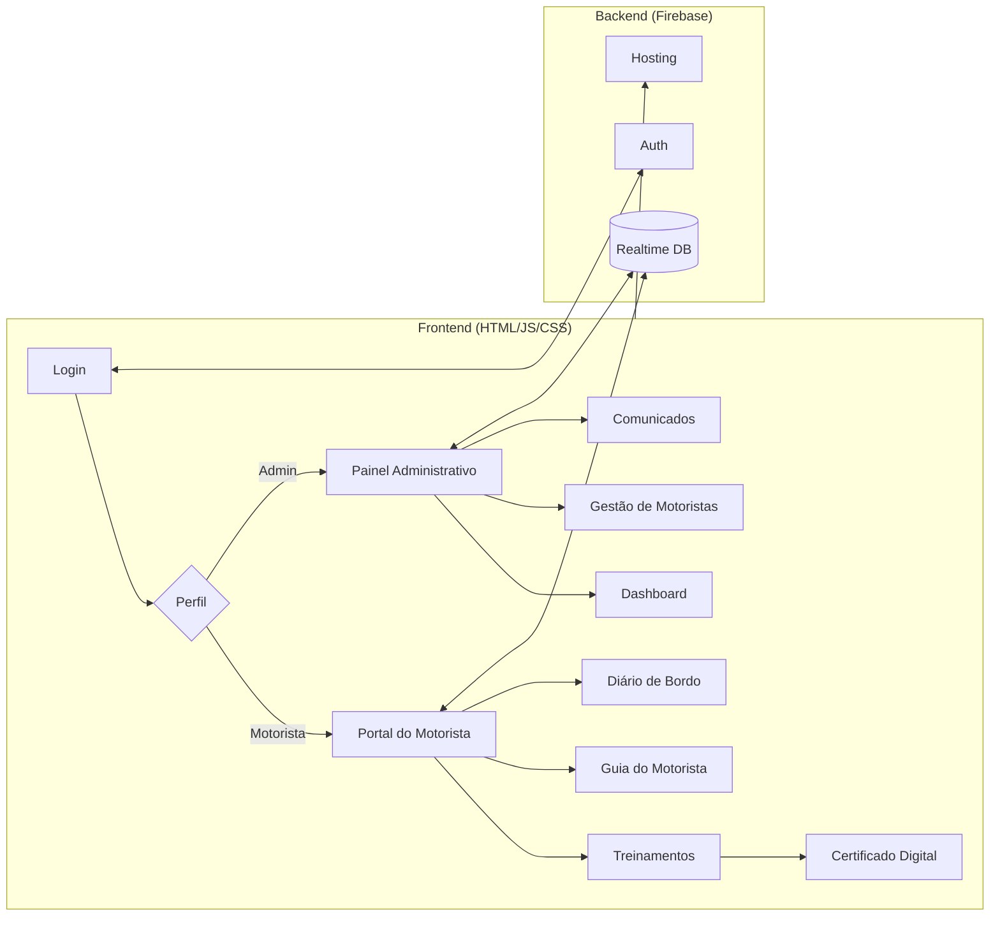
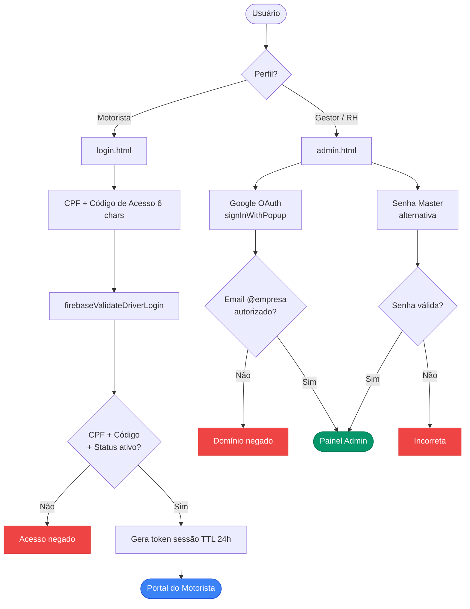
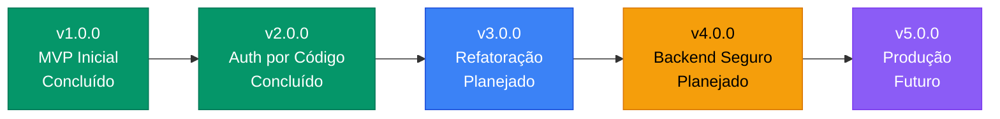
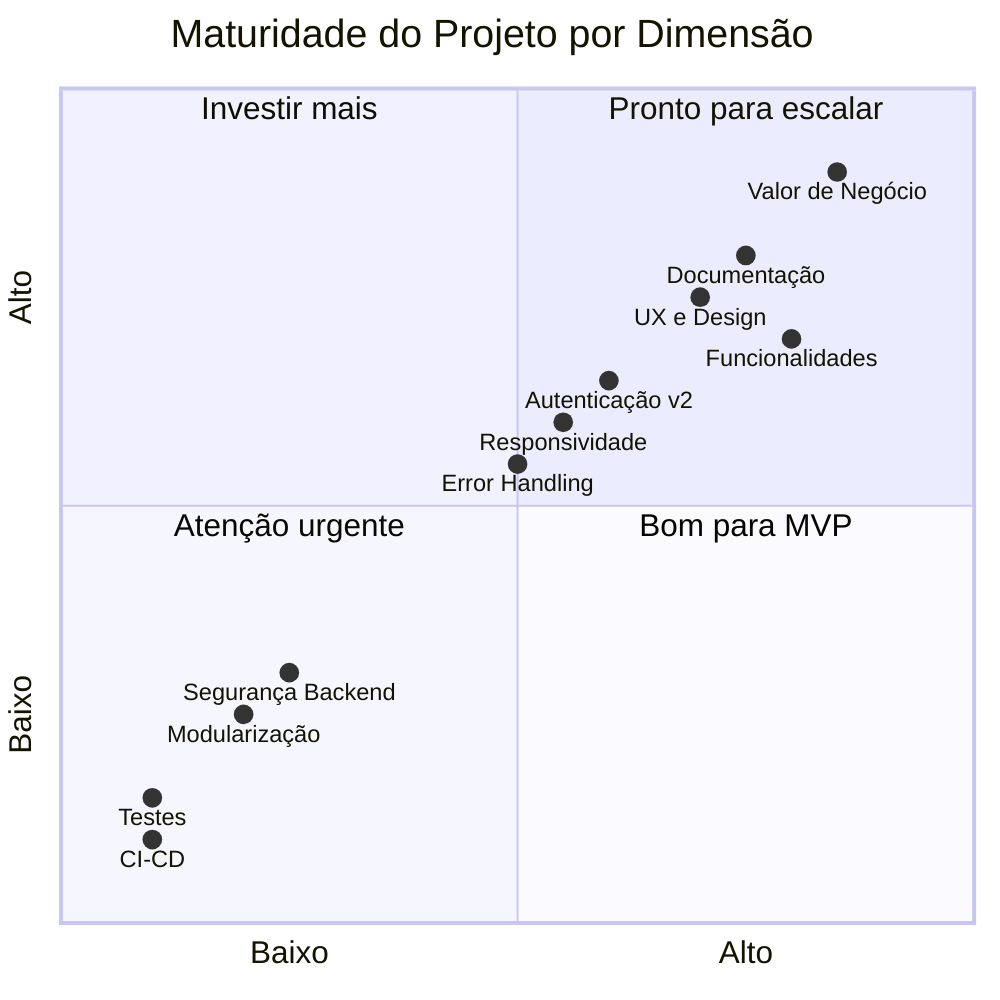

<h1 align="center">
   Gestão de Jornada  Motoristas
</h1>

<p align="center">
  <strong>MVP de sistema web para gestão de jornada, treinamento e certificação de motoristas de frota</strong>
</p>

<p align="center">
  
  
</p>

<p align="center">
  
  
  
  
  
</p>

<p align="center">
  
  
  
  
</p>

---

##  Sobre o Projeto

**MVP funcional** desenvolvido para uma transportadora real, atendendo **+200 motoristas** em operação rodoviária. A plataforma digitaliza o fluxo completo de treinamento obrigatório, controle de jornada e emissão de certificados  substituindo processos manuais em papel.

>  **Este é um MVP (Minimum Viable Product).** O foco desta versão foi **validar o modelo de negócio** e entregar valor ao usuário final o mais rápido possível. O roadmap de evolução técnica está documentado abaixo.

###  Problema

Transportadoras enfrentam:
- Controle de treinamentos via planilha (perda de dados, retrabalho)
- Certificados impressos sem rastreabilidade
- Dificuldade de comunicação com motoristas em trânsito
- Nenhuma visibilidade sobre taxa de conclusão por empresa/filial

###  Solução

Plataforma web responsiva (mobile-first) com:
- Autenticação dupla (motorista via CPF + Código / admin via Google OAuth)
- Dashboard administrativo em tempo real
- Sistema de cursos com vídeo + quiz
- Certificados digitais com QR Code
- Comunicados e FAQ centralizados

---

##  Arquitetura do MVP



### Fluxo de Autenticação (v2.0.0)



>  Documentação técnica completa: [`docs/ARQUITETURA_AUTENTICACAO.md`](docs/ARQUITETURA_AUTENTICACAO.md)

---

##  Funcionalidades

| Módulo | Descrição | Destaque Técnico |
|--------|-----------|------------------|
|  **Login Duplo** | Motorista (CPF + Código)  Admin (Google OAuth) | Auth Firebase + código alfanumérico 6 chars |
|  **Dashboard Admin** | KPIs em tempo real por empresa | Listeners `onValue` com atualização automática |
|  **Treinamentos** | Cursos com vídeo, quiz e progresso | Validação de conclusão por etapa |
|  **Certificados** | Geração automática com QR Code | Renderização canvas + `html2canvas` |
|  **Guia do Motorista** | Conteúdo educacional com imagens | Layout Tailwind CSS responsivo |
|  **Diário de Bordo** | Registro digital de viagens | Formulário com validação client-side |
|  **Comunicados** | Avisos com contatos WhatsApp | Cards interativos com links diretos |
|  **FAQ** | Perguntas frequentes com accordion | Animações CSS puras |
|  **Tabela de Motoristas** | Lista completa com status | Filtros dinâmicos por empresa |

---

##  Stack Técnica

```
Frontend        HTML5  CSS3  JavaScript (Vanilla ES6+)
UI Framework    Tailwind CSS (via CDN)
Backend         Firebase Realtime Database
Autenticação    Firebase Authentication (Google OAuth + Código de Acesso)
Hospedagem      Firebase Hosting
Certificados    html2canvas  QR Code Generator
Ícones          Phosphor Icons  Lucide Icons
```

---

##  Estrutura do Projeto

```
 index.html              # Portal principal do motorista
 login.html              # Autenticação (CPF + Código de Acesso)
 admin.html              # Painel administrativo completo
 treinamento.html        # Sistema de cursos e quiz
 certificado.html        # Geração de certificados digitais
 comunicado2.html        # Central de comunicados
 diario_bordo.html       # Registro de diário de bordo
 faq.html                # Perguntas frequentes
 tabela.html             # Tabela de motoristas
 firebase-config.js      # Config Firebase + funções de auth/DB
 drivers.js              # Wrapper de dados de motoristas
 database.rules.json     # Regras de segurança do Realtime DB
 .env.example            # Template de variáveis de ambiente
 docs/
    ARQUITETURA_AUTENTICACAO.md  # Doc técnico com Mermaid
 guia-motorista/
    index.html
    imagens/
 imagens/
```

---

##  Como Executar

### Pré-requisitos
- Conta no [Firebase](https://firebase.google.com/)
- Node.js 16+ (para Firebase CLI)
- Firebase CLI: `npm install -g firebase-tools`

### Setup

```bash
# 1. Clone o repositório
git clone https://github.com/lucianomjf14/gestao-jornada-motoristas.git
cd gestao-jornada-motoristas

# 2. Configure as variáveis de ambiente
cp .env.example .env
# Edite .env com suas credenciais Firebase

# 3. Atualize firebase-config.js com suas credenciais
# Substitua os placeholders YOUR_API_KEY, YOUR_AUTH_DOMAIN, etc.

# 4. Configure o Firebase
firebase login
firebase init

# 5. Deploy
firebase deploy
```

### Desenvolvimento Local

```bash
# Servir localmente com Firebase Emulator
firebase emulators:start

# Ou simplesmente abrir com Live Server (VS Code)
```

---

##  Segurança

### Implementado (v2.0.0)

-  Login por CPF + Código de Acesso alfanumérico (6 chars, ~729M combinações)
-  Sessão com TTL de 24 horas (token expira automaticamente)
-  Guard de sessão em todas as 9 páginas protegidas
-  Admin restrito por domínio de e-mail (Google OAuth)
-  Credenciais Firebase via `.env` (não versionadas)
-  Dados pessoais (CPFs, nomes reais) removidos do repositório

### Limitações conhecidas do MVP

-  Regras de banco permissivas (`auth != null`  requer refinamento por nó)
-  Código de acesso armazenado em plain text (sem hash)
-  Sem rate limiting nas tentativas de login
-  Session token usa `Math.random()` (não criptográfico)

> Estas limitações são aceitáveis para a fase de MVP/validação e estão mapeadas no roadmap de evolução.

---

##  Resultados

- **+200 motoristas** cadastrados e treinados
- **100% digital**  eliminação de processos em papel
- **Dashboard em tempo real** com taxa de conclusão por empresa
- **Certificados rastreáveis** via QR Code

---

##  Roadmap de Evolução

### Maturidade Atual: MVP Funcional



### v3.0.0  Refatoração Estrutural

| Item | Descrição | Impacto |
|------|-----------|---------|
|  Modularização | Extrair CSS e JS dos HTMLs monolíticos para arquivos separados | Manutenibilidade |
|  Deduplicação | Unificar `imagens/` e `guia-motorista/imagens/` (~7.8 MB) | Tamanho do repo |
|  Limpeza | Remover `console.log` de produção (~64 ocorrências) | Profissionalismo |
|  Package.json | Adicionar gestão de dependências e scripts de build | Padronização |
|  Design System | Extrair componentes reutilizáveis (botões, cards, modais) | Consistência visual |

### v4.0.0  Segurança & Backend

| Item | Descrição | Impacto |
|------|-----------|---------|
|  Database Rules | Regras granulares por nó (motorista lê apenas seus dados) | Segurança real |
|  Hashing | Armazenar `codigoAcesso` e `adminPassword` com bcrypt/SHA-256 | Proteção de credenciais |
|  Rate Limiting | Cloud Functions para limitar tentativas de login (5/min) | Anti brute-force |
|  Crypto Token | Substituir `Math.random()` por `crypto.getRandomValues()` | Token seguro |
|  Cloud Functions | Migrar validações críticas para server-side | Zero trust |

### v5.0.0  Produção & DevOps

| Item | Descrição | Impacto |
|------|-----------|---------|
|  Testes | Jest + Testing Library para funções críticas de auth | Confiabilidade |
|  CI/CD | GitHub Actions (lint  test  deploy Firebase Hosting) | Automação |
|  Monitoramento | Firebase Analytics + Performance Monitoring | Observabilidade |
|  Acessibilidade | Audit WCAG 2.1 AA (aria-labels, landmarks, contraste) | Inclusão |
|  PWA | Service Worker + manifest para uso offline | Motoristas em trânsito |

---

##  Análise de Maturidade



| Dimensão | Nível | Status |
|----------|-------|--------|
|  Valor de negócio |  10/10 | Resolve problema real, +200 usuários |
|  Documentação |  8/10 | README, Mermaid, doc técnico, releases |
|  UX / Design |  7/10 | Mobile-first, Tailwind, responsivo |
|  Funcionalidades |  8/10 | 9 módulos completos e integrados |
|  Autenticação |  6/10 | v2.0.0 é sólida, mas front-end only |
|  Testes |  1/10 | Zero cobertura |
|  CI/CD |  0/10 | Inexistente |
|  Arquitetura |  3/10 | Monolíticos, sem modularização |
|  Segurança backend |  2/10 | Rules permissivas, plain text |

---

##  Licença

Este projeto está sob a licença MIT. Veja o arquivo [LICENSE](LICENSE) para mais detalhes.

---

## Changelog

| Versão | Data | Descrição |
|--------|------|-----------|
| [v2.0.0](https://github.com/lucianomjf14/gestao-jornada-motoristas/releases/tag/v2.0.0) | 13/02/2026 | Auth por Código de Acesso + Session TTL 24h + Guard em 9 páginas |
| [v1.0.0](https://github.com/lucianomjf14/gestao-jornada-motoristas/releases/tag/v1.0.0) | 12/02/2026 | Release inicial  sistema completo com 9 módulos |

---

## Autor

<div align="center">


### Luciano Marinho Silveira

Mestre em Administração | Gestão e Arquitetura Organizacional | Processos, Dados e Inovação | Inteligência Artificial

Juiz de Fora, MG, Brasil

[](https://github.com/lucianomjf14)
[](https://www.linkedin.com/in/luciano-marinho-silveira)
[](https://web.dio.me/users/lucianomjf14)
[](http://lattes.cnpq.br/8717991759915273)
[](mailto:lucianomjf14@gmail.com)

</div>
