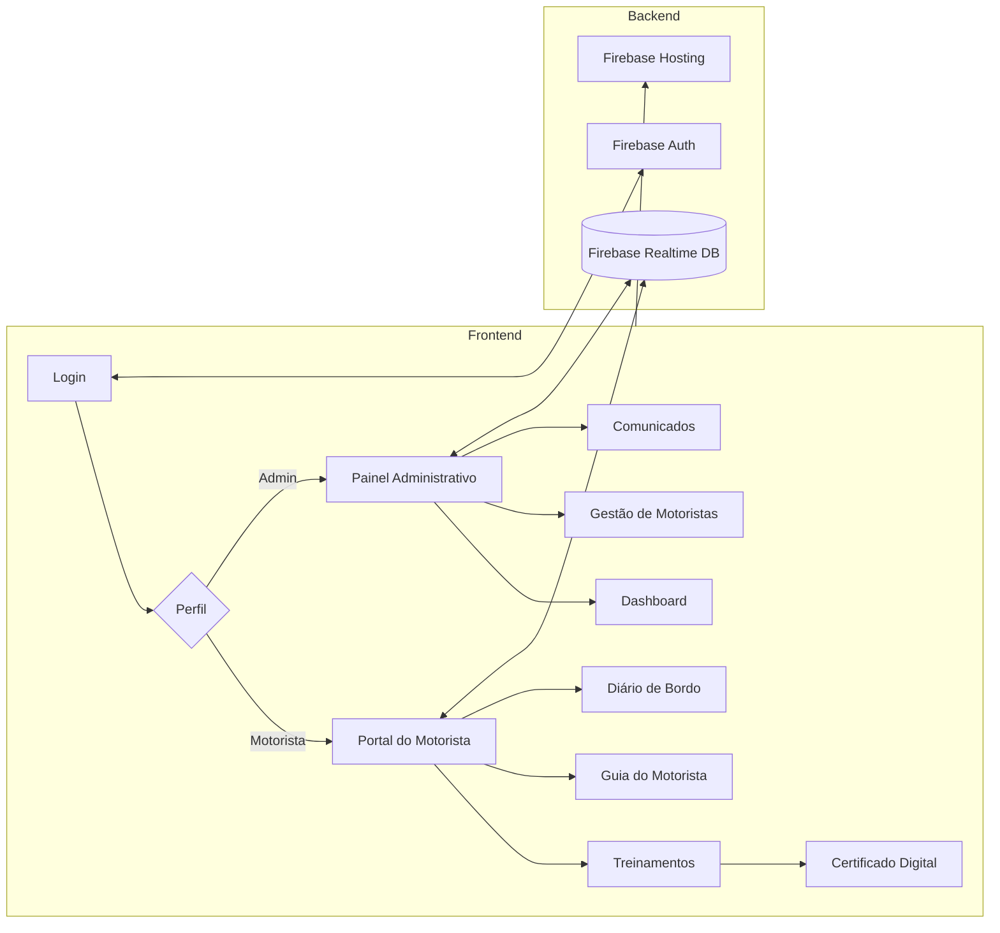

<h1 align="center">
  🚛 Gestão de Jornada — Motoristas
</h1>

<p align="center">
  <strong>Sistema web completo para gestão de jornada, treinamento e certificação de motoristas de frota</strong>
</p>

<p align="center">
  
  
  
  
  
</p>

<p align="center">
  
  
  
</p>

---

## 📋 Sobre o Projeto

Sistema web desenvolvido para uma transportadora real, atendendo **+200 motoristas** em operação rodoviária. A plataforma digitaliza todo o fluxo de treinamento obrigatório, controle de jornada e emissão de certificados — substituindo processos manuais em papel.

### 🎯 Problema

Transportadoras enfrentam:
- Controle de treinamentos via planilha (perda de dados, retrabalho)
- Certificados impressos sem rastreabilidade
- Dificuldade de comunicação com motoristas em trânsito
- Nenhuma visibilidade sobre taxa de conclusão por empresa/filial

### 💡 Solução

Plataforma web responsiva (mobile-first) com:
- Login diferenciado (motorista via CPF / admin via Google)
- Dashboard administrativo em tempo real
- Sistema de cursos com vídeo + quiz
- Certificados digitais com QR Code
- Comunicados e FAQ centralizados

---

## 🏗️ Arquitetura



---

## ✨ Funcionalidades

| Módulo | Descrição | Destaque Técnico |
|--------|-----------|------------------|
| 🔐 **Login Duplo** | Motorista (CPF) · Admin (Google OAuth) | Autenticação Firebase com domínio restrito |
| 📊 **Dashboard Admin** | KPIs em tempo real por empresa | Listeners `onValue` com atualização automática |
| 🎓 **Treinamentos** | Cursos com vídeo, quiz e progresso | Validação de conclusão por etapa |
| 📜 **Certificados** | Geração automática com QR Code | Renderização canvas + `html2canvas` |
| 📖 **Guia do Motorista** | Conteúdo educacional com imagens | Layout Tailwind CSS responsivo |
| 📝 **Diário de Bordo** | Registro digital de viagens | Formulário com validação client-side |
| 📢 **Comunicados** | Avisos com contatos WhatsApp | Cards interativos com links diretos |
| ❓ **FAQ** | Perguntas frequentes com accordion | Animações CSS puras |
| 📋 **Tabela de Motoristas** | Lista completa com status | Filtros dinâmicos por empresa |

---

## 🛠️ Stack Técnica

```
Frontend       → HTML5 · CSS3 · JavaScript (Vanilla ES6+)
UI Framework   → Tailwind CSS (via CDN)
Backend        → Firebase Realtime Database
Autenticação   → Firebase Authentication (Email/Password + Google OAuth)
Hospedagem     → Firebase Hosting
Certificados   → html2canvas · QR Code Generator
Ícones         → Lucide Icons · Font Awesome
```

---

## 📁 Estrutura do Projeto

```
├── index.html              # Portal principal do motorista
├── login.html              # Tela de autenticação
├── admin.html              # Painel administrativo completo
├── treinamento.html        # Sistema de cursos e quiz
├── certificado.html        # Geração de certificados digitais
├── comunicado2.html        # Central de comunicados
├── diario_bordo.html       # Registro de diário de bordo
├── faq.html                # Perguntas frequentes
├── tabela.html             # Tabela de motoristas
├── firebase-config.js      # Configuração Firebase (use .env)
├── drivers.js              # Dados de motoristas
├── database.rules.json     # Regras de segurança do Realtime DB
├── .firebaserc             # Configuração de projeto Firebase
├── firebase.json           # Configuração de deploy
├── .env.example            # Template de variáveis de ambiente
├── guia-motorista/         # Guia educacional do motorista
│   ├── index.html
│   └── imagens/
└── imagens/                # Assets visuais
```

---

## 🚀 Como Executar

### Pré-requisitos
- Conta no [Firebase](https://firebase.google.com/)
- Node.js 16+ (para Firebase CLI)
- Firebase CLI: `npm install -g firebase-tools`

### Setup

```bash
# 1. Clone o repositório
git clone https://github.com/lucianomjf14/gestao-jornada-motoristas.git
cd gestao-jornada-motoristas

# 2. Configure as variáveis de ambiente
cp .env.example .env
# Edite .env com suas credenciais Firebase

# 3. Atualize firebase-config.js com suas credenciais
# Substitua os placeholders YOUR_API_KEY, YOUR_AUTH_DOMAIN, etc.

# 4. Configure o Firebase
firebase login
firebase init

# 5. Deploy
firebase deploy
```

### Desenvolvimento Local

```bash
# Servir localmente com Firebase Emulator
firebase emulators:start

# Ou simplesmente abrir com Live Server (VS Code)
```

---

## 🔒 Segurança

- ✅ Credenciais Firebase via variáveis de ambiente (`.env`)
- ✅ Regras de banco com autenticação obrigatória
- ✅ Domínio admin restrito por e-mail
- ✅ Dados pessoais (CPFs, nomes) não versionados
- ✅ Logos corporativos removidos (substituídos por placeholders)

> ⚠️ **Nota:** Este repositório é uma versão sanitizada para portfólio. Dados corporativos, credenciais e informações pessoais foram removidos ou substituídos por placeholders.

---

## 📈 Resultados

- **+200 motoristas** cadastrados e treinados
- **100% digital** — eliminação de processos em papel
- **Dashboard em tempo real** com taxa de conclusão por empresa
- **Certificados rastreáveis** via QR Code

---

## 📄 Licença

Este projeto está sob a licença MIT. Veja o arquivo [LICENSE](LICENSE) para mais detalhes.

---

## Autor

<div align="center">


### Luciano Marinho Silveira

Mestre em Administração | Gestão e Arquitetura Organizacional | Processos, Dados e Inovação | Inteligência Artificial

Juiz de Fora, MG, Brasil

[](https://github.com/lucianomjf14)
[](https://www.linkedin.com/in/luciano-marinho-silveira)
[](https://web.dio.me/users/lucianomjf14)
[](http://lattes.cnpq.br/8717991759915273)
[](mailto:lucianomjf14@gmail.com)

</div>
