# 🔐 Arquitetura de Autenticação — v2.0.0

> **Documento Técnico** | Controle de Jornada de Motoristas  
> Atualizado em: 13/02/2026 | Versão: 2.0.0  
> Autor: Luciano Marinho Silveira

---

## Índice

1. [Visão Geral](#visão-geral)
2. [Fluxo do Motorista](#fluxo-do-motorista)
3. [Fluxo da Empresa (Admin)](#fluxo-da-empresa-admin)
4. [Gestão de Códigos de Acesso](#gestão-de-códigos-de-acesso)
5. [Controle de Sessão](#controle-de-sessão)
6. [Arquitetura de Segurança](#arquitetura-de-segurança)
7. [Referência Técnica](#referência-técnica)

---

## Visão Geral

O sistema possui **dois perfis de acesso** com mecanismos de autenticação distintos:

| Perfil | Método | Página | Destino |
|--------|--------|--------|---------|
| **Motorista** | CPF + Código de Acesso (6 chars) | `login.html` | `index.html` (portal) |
| **Admin (Empresa)** | Google OAuth (domínio restrito) ou Senha Master | `admin.html` | Painel Administrativo |

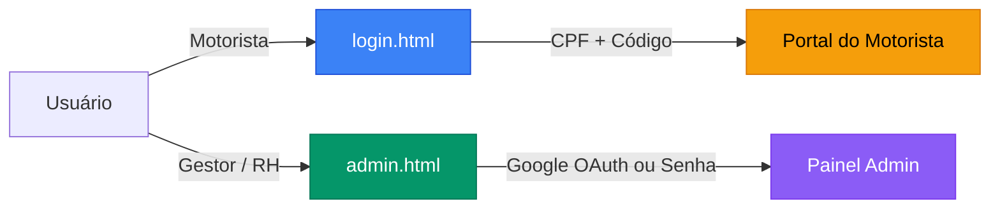

---

## Fluxo do Motorista

### Diagrama Completo

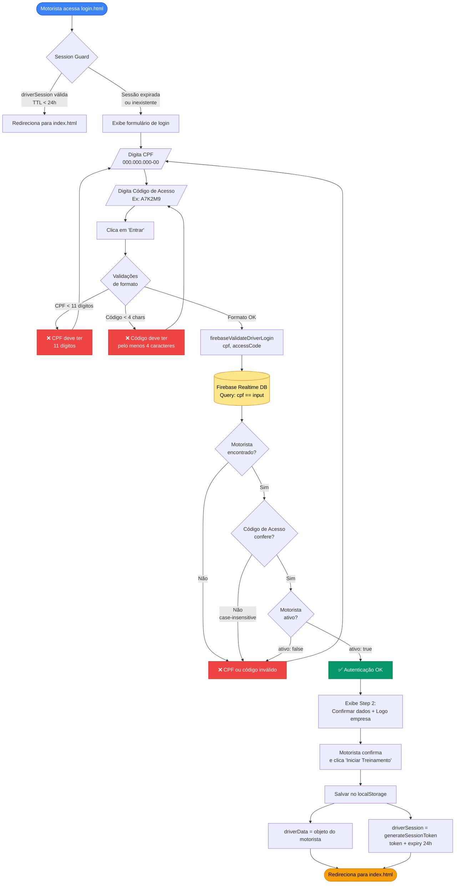

### Sequência Detalhada

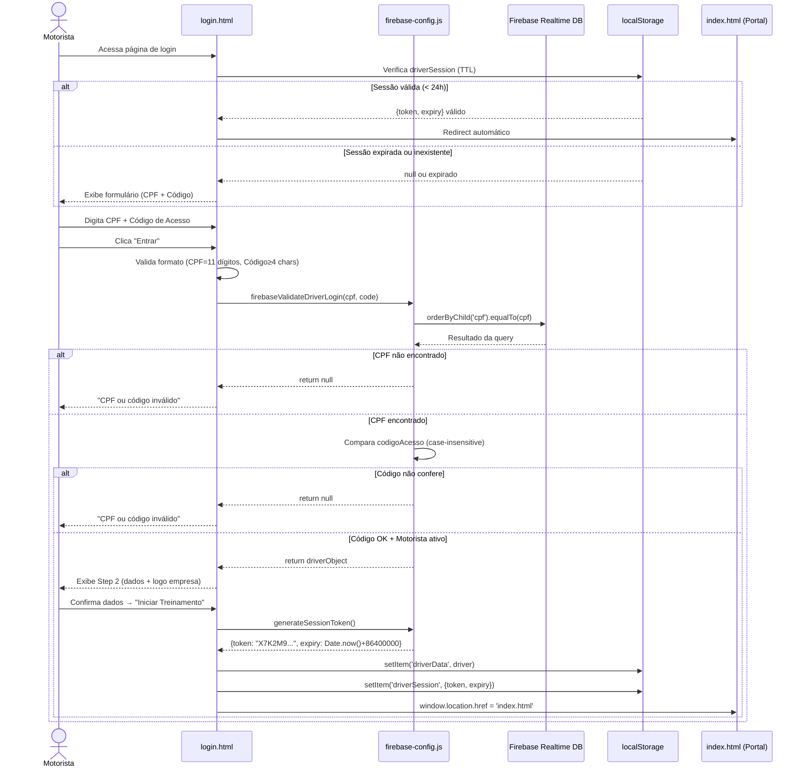

---

## Fluxo da Empresa (Admin)

### Diagrama Completo

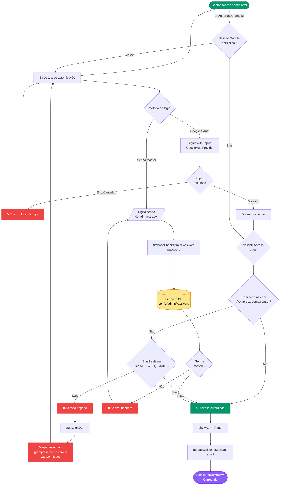

### Sequência Detalhada

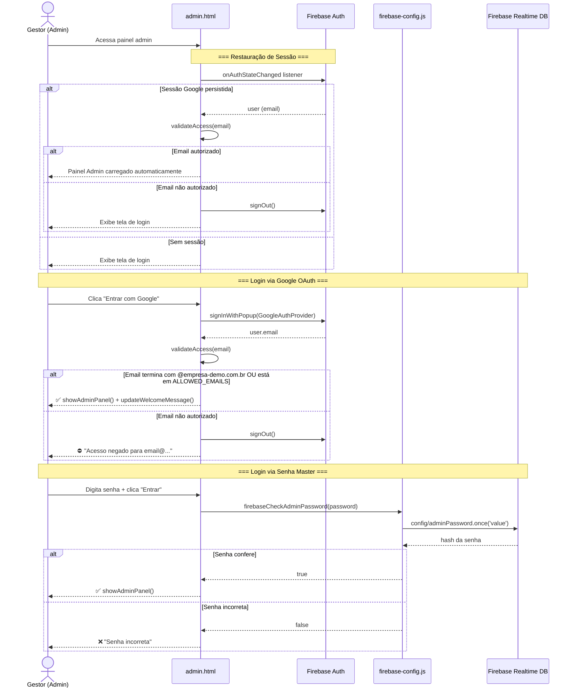

---

## Gestão de Códigos de Acesso

### Ciclo de Vida do Código

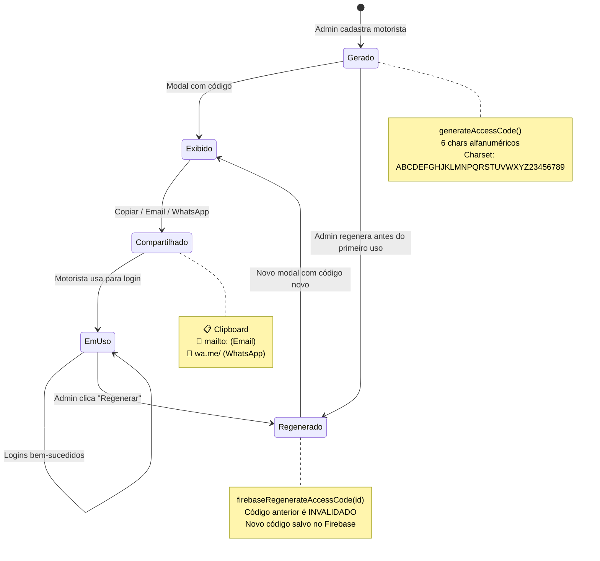

### Fluxo de Cadastro + Código

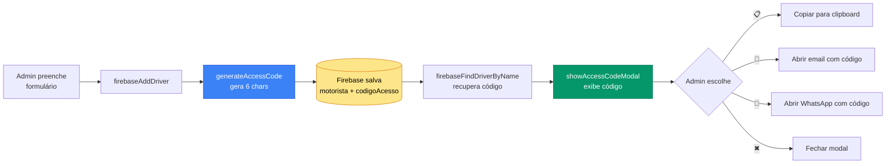

### Fluxo de Regeneração

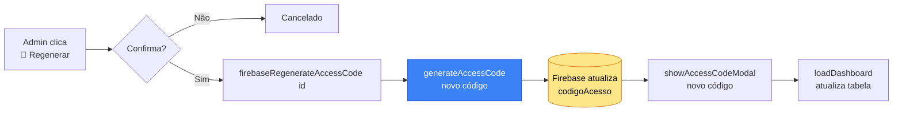

---

## Controle de Sessão

### Mecanismo de TTL

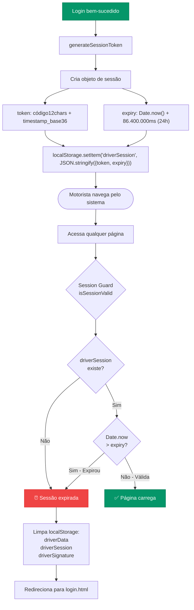

### Cobertura por Página

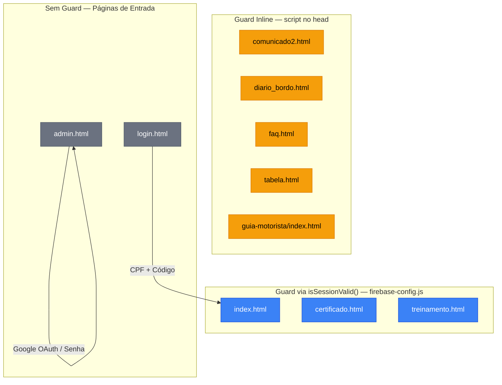

---

## Arquitetura de Segurança

### Modelo de Ameaças vs. Proteções

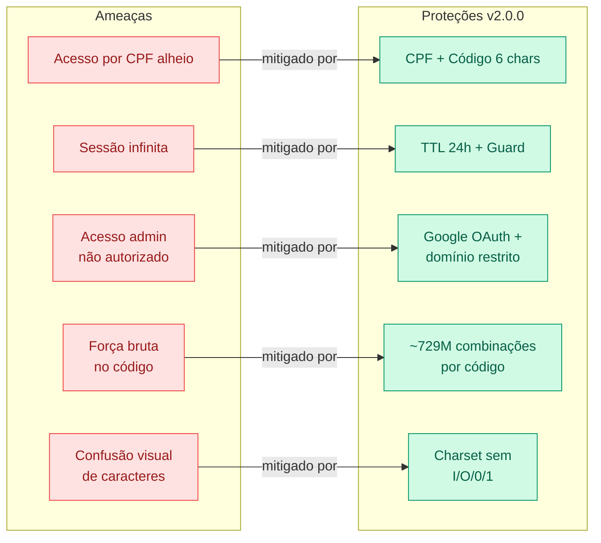

### Comparativo v1.0 → v2.0

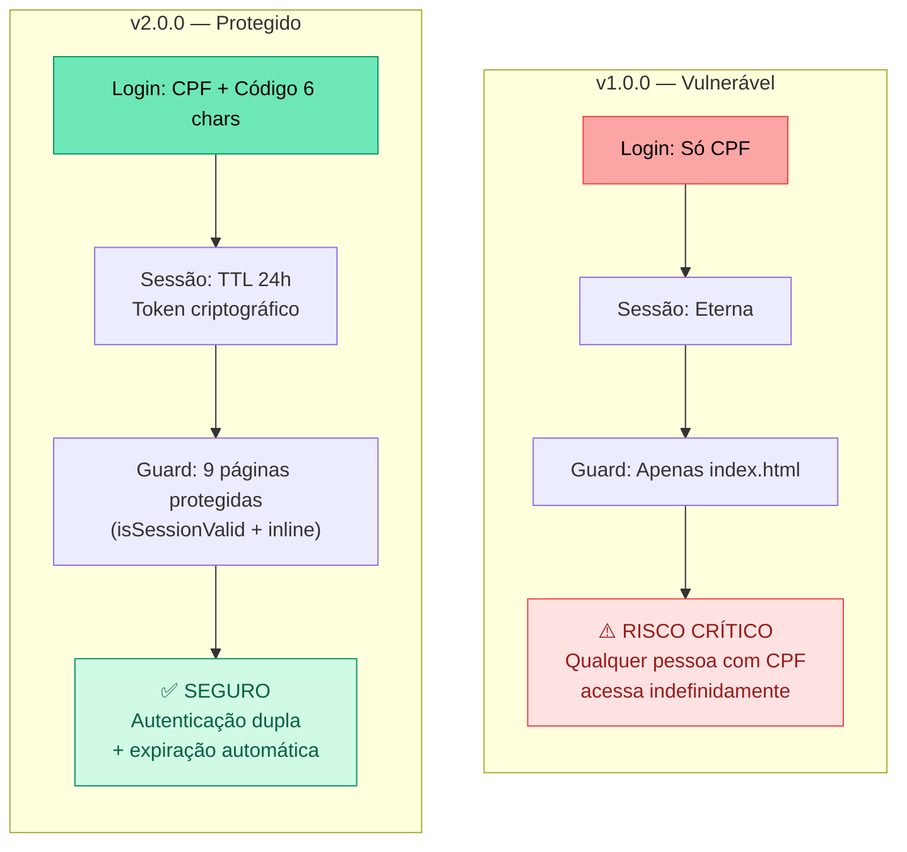

---

## Referência Técnica

### Funções de Autenticação (`firebase-config.js`)

| Função | Tipo | Descrição |
|--------|------|-----------|
| `generateAccessCode()` | Sync | Gera código alfanumérico de 6 chars (charset: `ABCDEFGHJKLMNPQRSTUVWXYZ23456789`) |
| `firebaseValidateDriverLogin(cpf, accessCode)` | Async | Valida CPF + código + status ativo. Retorna driver ou `null` |
| `firebaseRegenerateAccessCode(id)` | Async | Gera novo código, atualiza Firebase, retorna novo código |
| `generateSessionToken()` | Sync | Cria `{token, expiry}` com TTL de 24 horas (86.400.000 ms) |
| `isSessionValid()` | Sync | Verifica `driverSession` no localStorage. Limpa e retorna `false` se expirado |
| `firebaseCheckAdminPassword(password)` | Async | Compara senha com `config/adminPassword` no Firebase |

### Estrutura de Dados no Firebase

```json
{
  "motoristas": {
    "0": {
      "nome": "João Silva",
      "cpf": "12345678901",
      "email": "joao@email.com",
      "empresa": "Empresa A",
      "codigoAcesso": "A7K2M9",
      "ativo": true,
      "senhaOperacao": "1234",
      "senhaCoacao": "5678"
    }
  },
  "config": {
    "adminPassword": "hash_da_senha"
  }
}
```

### Estrutura de Sessão no localStorage

```json
// driverSession
{
  "token": "A7K2M9X3P5R8QW1707840000",
  "expiry": 1707926400000
}

// driverData
{
  "id": "0",
  "nome": "João Silva",
  "cpf": "12345678901",
  "empresa": "Empresa A",
  "email": "joao@email.com"
}
```

### Charset do Código de Acesso

```
A B C D E F G H J K L M N P Q R S T U V W X Y Z 2 3 4 5 6 7 8 9
└──────────────── 30 caracteres ────────────────┘

Excluídos: I (confunde com 1), O (confunde com 0), 0, 1

Combinações: 30⁶ = 729.000.000 (~729 milhões)
```

---

> **Nota:** Este documento acompanha a Release [v2.0.0](https://github.com/lucianomjf14/gestao-jornada-motoristas/releases/tag/v2.0.0).  
> Para a lista completa de mudanças, consulte o [Full Changelog](https://github.com/lucianomjf14/gestao-jornada-motoristas/compare/v1.0.0...v2.0.0).
